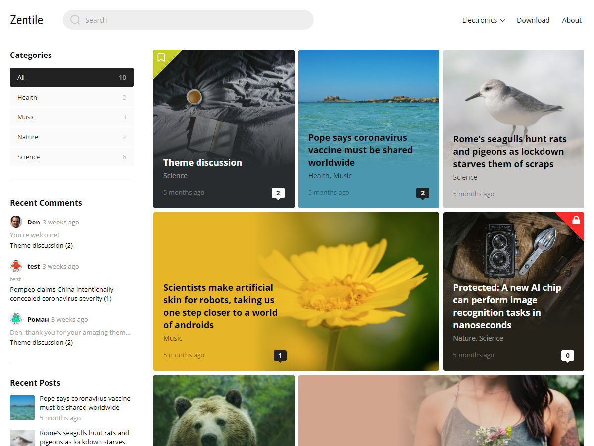

# Zentile


Zentile is a lightweight magazine theme inspired by Yandex.Zen.

**[Demo](https://wpshowcase.site/)** • **[Download v1.3.2](https://github.com/denitcoder/wp-theme-zentile/releases/download/v1.3.2/zentile-1.3.2.zip)**



## Features

- Browsers: Edge, Chrome, Firefox, Safari, Opera
- Languages: English, Russian
- Responsive design
- Gutenberg-ready
- Translation-ready
- Built-in image light box
- Theme settings
    - Customizable logo
    - Customizable background
    - Show/hide featured image at the top of the post
    - Show/hide author bio at the end of the post
    - Always show sidebar
- Custom widgets
    - Categories
    - Recent comments
    - Recent posts

## Requirements

- PHP >= 5.6
- Wordpress >= 5.3.x

## Installation

- Download the theme from the **[releases](https://github.com/denitcoder/wp-theme-zentile/releases)** page on GitHub (**zentile-x.y.zip**).
- Go to **Appearance > Themes > Add New > Upload Theme** and upload the downloaded archive with the theme (**WP version < 5.5**: In order to update the theme in the future you need to install [Easy Theme and Plugin Upgrades](https://wordpress.org/plugins/easy-theme-and-plugin-upgrades/) plugin).
- **OR** Unzip the archive to the `/wp-content/themes/` directory.
- Go to **Appearance > Themes** and activate it.

## Post installation

- Go to **Settings > Reading** and set **Blog pages show at most** to 5n (e.g. 5, 10, ...).
- Go to **Appearance > Widgets** and add widgets **Zentile: Categories**, **Zentile: Recent Comments** and **Zentile: Recent Posts**.
- Go to **Appearance > Customize** and customize theme as you need.

## Use the dominant color in the posts gradients

If you want the post card's gradients to match its featured image dominant color, follow the steps below:

- Install and activate plugin [Color Palette Generator](https://wordpress.org/plugins/color-palette-generator/).
- Go to **Media > Color Palette Generator** and set:
    - **Number of colors to generate**: 1
    - **Automatically generate palettes on upload?**: checked
- Click **Save Changes**.
- Click **Generate**.

**Notice:** The plugin automatically generate palettes for the images only if you upload them via the **Media > Add New** page, otherwise you need to generate it manually.

## Development

**Requirements:** Node.js >= 12.x, Git

```bash
cd <wordpress>/wp-content/themes/
git clone https://github.com/denitcoder/wp-theme-zentile.git zentile
cd zentile

# install dependencies
npm install

# compile and minify all theme assets
npm run build

# or watch for changes
npm run watch

# or compile all assets and create the archive with the theme (e.g. <zentile>/releases/zentile-x.y.zip)
npm run release
```

## Structure

```
Zentile
├── assets - Uncompiled assets (js, css)
├── dist - Compiled and minified assets
├── releases - Zipped builds ready to publish
├── components - HTML components (buttons, alerts etc)
├── inc - Classes and utils
├── widgets - Custom widget classes
└── languages - Translations
```